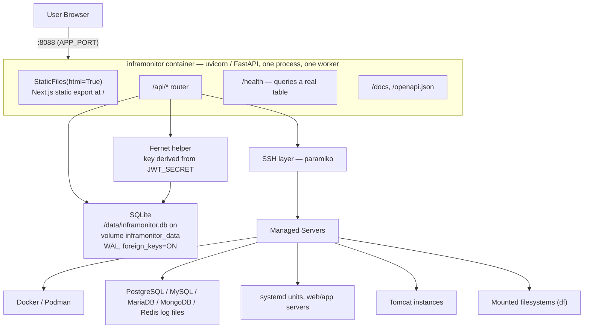
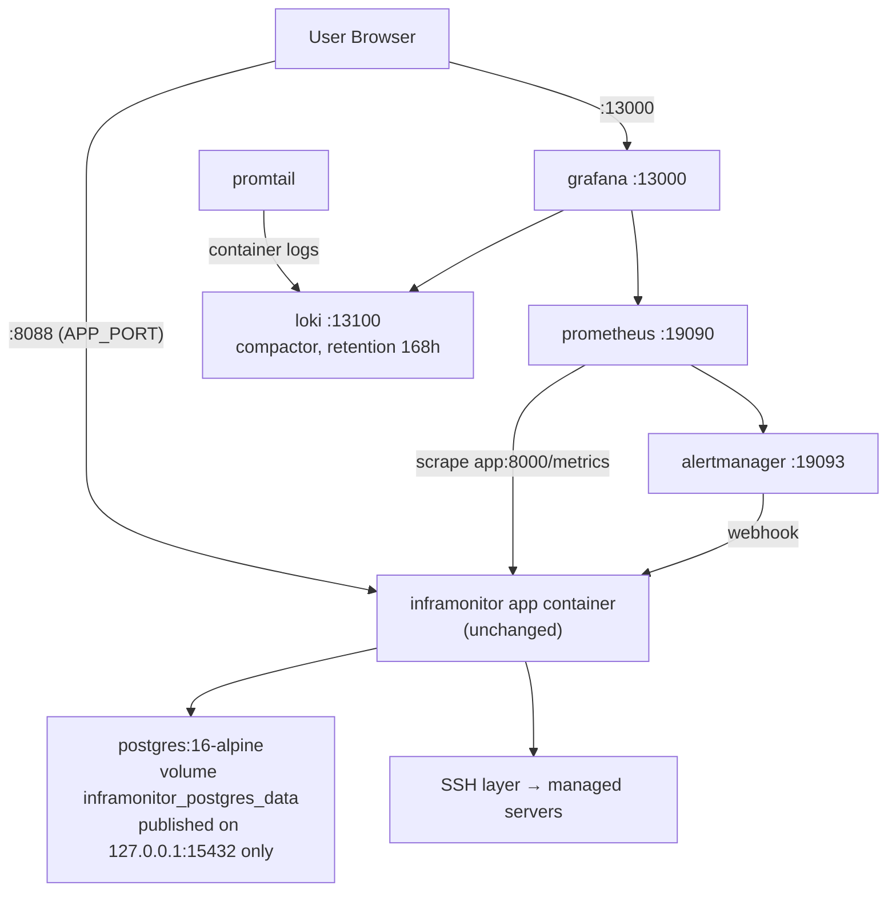

# Architecture

Infra Monitor is a single Python process. It owns server inventory, users and RBAC, per-server access
control, encrypted SSH credential storage, discovery, and remote read/restart/deploy operations over
SSH. There are no sidecars, no message broker and no cache tier.

It ships in **two install profiles** ([Deployment.md](Deployment.md#choosing)). The application is the
same process, the same image and the same code in both:

| | Lite | Full |
| --- | --- | --- |
| Application | one `app` container | the same one `app` container |
| Database | SQLite file | PostgreSQL 16-alpine |
| Around it | nothing | Prometheus, Grafana, Loki, Promtail, Alertmanager |

**Full mode does not change the application's architecture.** It swaps the storage engine behind the
same SQLAlchemy layer and adds observability containers that talk *to* the app, never through it. No
request path, no permission check and no SSH operation differs between profiles. Two things differ in
the app itself, both from environment variables:

- `/metrics` is registered only when `METRICS_ENABLED=true`.
- The four monitoring URLs are set, so `GET /api/integrations` has something to probe.

## Topology — lite

## Topology — full

The same `app` container, with Postgres behind it and five observability containers alongside:

Note the direction of every added arrow: Prometheus scrapes the app, Promtail reads its container logs,
Alertmanager posts to it. The app does not depend on any of them to serve a request — if the whole
monitoring set is down, Infra Monitor works. The one exception is `GET /api/integrations`, which probes them and
reports `offline`.

Alertmanager's webhook lands in an **in-memory ring buffer of the last 100 alerts, lost on restart** —
see [Monitoring.md](Monitoring.md#the-alert-buffer-is-in-memory-and-lost-on-restart).

Everything the browser touches is on one origin, served by one process:

| Path | Handler |
| --- | --- |
| `/api/*` | the REST router (`backend/app/api/routes.py`) |
| `/health` | liveness; queries a real table and returns **503** with `"database": "unavailable"` if it fails |
| `/metrics` | Prometheus exposition — **registered only when `METRICS_ENABLED=true`**, so it does not exist in lite |
| `/docs`, `/openapi.json` | FastAPI's own Swagger UI and schema |
| everything else | the static UI export, mounted **after** the router so API paths win |

`/metrics` being conditionally *registered* rather than conditionally *answered* is deliberate: in lite
the route is absent, so a request falls through to the static mount and gets the UI's 404 rather than a
route that exists and refuses.

The static mount is guarded by `os.path.isdir(settings.static_dir)`, so a source checkout with no UI
build still starts and serves the API.

## Request flow

There are only two kinds of request.

1. **Local reads and writes.** Inventory, users, policies, settings and dashboard counts are plain
   SQLite queries. Fast, no network.
2. **Live host operations.** Containers, logs, Tomcat, service restart, `test-connection` and
   `discover` open an SSH connection to the target host, run a command, parse the output, and
   return. Nothing is polled in the background and no agent is installed on the managed host — a
   panel is only as fresh as the last time someone loaded it. Discovery results are additionally
   persisted onto the server row, so the Overview, Storage, Services, Database Logs and Tomcat tabs
   can render a stored snapshot without an SSH round trip.

## Data store

One `DATABASE_URL`, two dialects. `core/database.py` branches on the dialect: SQLite gets
`check_same_thread=False` plus the per-connection pragmas below, anything else gets a plain engine with
none of the SQLite-only settings applied. Everything above that layer — models, queries, the startup
migration — is dialect-neutral.

### Lite: SQLite

One file, `./data/inframonitor.db`, relative to the working directory — `/app` in the container, with the volume
mounted at `/app/data`, so the same `DATABASE_URL` works in Docker and in a local checkout.

Engine setup that matters:

- `check_same_thread=False` — FastAPI runs the sync route handlers on a threadpool, so a connection
  is used from a thread other than the one that created it.
- Per-connection pragmas: `journal_mode=WAL`, `synchronous=NORMAL`, `busy_timeout=5000`,
  `foreign_keys=ON`. WAL plus a busy timeout is what stops one slow SSH request from producing
  "database is locked" for every other caller.
- **One worker.** `create_all` and the startup migration step are not safe to run concurrently, and
  SQLite has a single writer. Do not add `--workers`.

### Full: PostgreSQL

The overlay sets `DATABASE_URL` to a `postgresql+psycopg://` DSN against the `postgres` service. None of
the SQLite-only engine settings apply — no `check_same_thread`, no WAL or `busy_timeout` pragmas, since
those are SQLite concepts and Postgres has its own MVCC and locking.

Still **one worker**, for the same reason: the startup schema/migration step is not concurrency-safe.
Postgres would tolerate concurrent writers, but the startup path is what constrains this, not the
engine.

There is **no cross-profile migration**. The two databases are separate stores and nothing copies
between them ([Deployment.md](Deployment.md#switching-profiles)).

### Startup schema handling (both profiles)

On startup the app creates any missing tables, adds any missing columns on `servers` via an
inspector-driven `ALTER TABLE` loop (so upgrading an existing database works), backfills `public_id`
values, and seeds the dropdown option lists plus the administrator user.

The loop is inspector-driven and dialect-neutral, so it runs on both engines — including the
`last_discovery TIMESTAMP` column, whose declared type is valid in both.

The seeded administrator's email and password come from the `admin_email` / `admin_password` settings
(`ADMIN_EMAIL`, `ADMIN_PASSWORD`), defaulting to `admin@inframonitor.local` / `ChangeMe123!`. The seed only runs
when the user does not already exist, so those variables have no effect on an existing database. While
that password is still in force the app logs a banner on every boot, and `GET /api/auth/me` reports
`using_default_password: true` for the UI's warning banner.

## Credential handling

SSH passwords and private keys are encrypted with Fernet before they are written to the database and
decrypted only in the process that is about to open the SSH connection. The API never returns a
credential value, and non-admin roles cannot write one.

`backend/app/core/crypto.py` is a small helper: it SHA-256s `JWT_SECRET` and base64-encodes the
digest to make the Fernet key. It is not a secret manager and there is no external key store — the
consequence is that **`JWT_SECRET` is the encryption key for every stored credential**. See
[Security.md](Security.md) and [BackupRecovery.md](BackupRecovery.md).

## RBAC

Three roles. The `administrator` value stored in the database is normalized to `admin` in the token
and in `GET /api/auth/me`, so clients only ever see `admin`.

| Capability | `admin` | `developer` | `support` |
| --- | :---: | :---: | :---: |
| View servers, storage, services, containers, logs, Tomcat instances | yes | yes | yes |
| Read container / journal / database / Tomcat logs | yes | yes | yes |
| Refresh vitals (`POST /api/servers/{id}/vitals`) | yes | yes | yes |
| **Restart a container** (`/container-restart`) | yes | **yes** | no |
| **Open an interactive shell** (`WS /api/servers/{id}/shell`) | yes | no | no |
| **Browse, download or upload files** (`/sftp/list`, `/sftp/download`, `/sftp/upload`) | yes | no | no |
| **Delete files or directories** (`/sftp/delete`) | yes | no | no |
| Save and use personal shell favorites (`/api/shell/favorites`) | yes | yes | yes |
| Restart a systemd service | yes | no | no |
| Tomcat start / stop / restart | yes | no | no |
| **Deploy a WAR** to a Tomcat instance | yes | no | no |
| Add, import or delete servers | yes | no | no |
| Save or update SSH credentials | yes | no | no |
| Run discovery | yes | no | no |
| Manage users, policies, dropdown options | yes | no | no |

Only admins can store or update SSH credentials, and no role can read one back out of the API.
Developer and support users operate on servers without ever holding the password.

On top of the role check, every server-scoped route resolves the target through a per-server ACL:
admins reach every server, and everyone else reaches only servers granted to them directly or by a
matching access policy. See [API.md](API.md#per-server-access-control-acl).

## What is deliberately not here

In **either** profile:

- **Almost no audit trail.** The `audit_logs` table in `models/entities.py` has **five writers**, all in
  the shell workspace's own surface: the interactive shell handler records `shell.open` and `shell.close`
  per session (actor, server, duration, byte counts — not the commands run), and the SFTP routes record
  `sftp.download` and `sftp.upload` with the remote path and byte count, and `sftp.delete` with the path,
  the recursive flag and how many entries were removed. Directory listings are not recorded. Every other
  operator action, **including WAR deployments, service restarts, Tomcat start/stop, credential changes,
  server and user edits and log reads, is unrecorded** — a longer list than the recorded one — and no
  endpoint or page reads the table back. Five audited actions are not an audit trail. See
  [Security.md](Security.md#what-does-not-exist).
- **No Redis.** No module under `backend/app` imports it, and none ever did. Previously it was a
  container with a volume and a `service_healthy` gate on the backend, doing nothing.
- **No reverse proxy, and therefore no TLS.** The process serves plain HTTP. Nginx was not restored in
  full mode either: the app serves its own UI, so a proxy would only forward to it, and the old
  `/grafana/` sub-path route was broken because it needed `GF_SERVER_SERVE_FROM_SUB_PATH`, never set. In
  full mode Grafana is reached on its own port. TLS is the operator's responsibility.
- **No cache or job queue.** Every request does its work inline.
- **No background polling, and therefore no continuous monitoring of managed hosts.** Nothing refreshes a
  panel or re-probes a host on a timer. The vitals columns (uptime, load, CPU %, RAM, process count) are
  **point-in-time samples** taken during discovery or when an operator presses *Refresh vitals*, stamped
  with `vitals_checked_at`. There is no time series, no history and no threshold alerting on them; a value
  is as old as its timestamp. Full mode's Prometheus scrapes *this application*, not the managed hosts.
- **No durable alert storage.** Full mode's webhook keeps 100 alerts in memory and loses them on
  restart.

In **lite** additionally:

- **No metrics endpoint, no scraper, no log shipper.** `/metrics` is not registered. Container and host
  logs are read on demand over SSH, not collected. `GET /api/integrations` still exists but returns an
  empty list when no monitoring URL is configured, and the dashboard hides the panel in that case.
